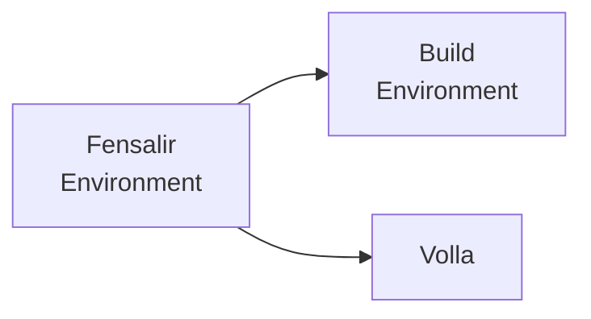
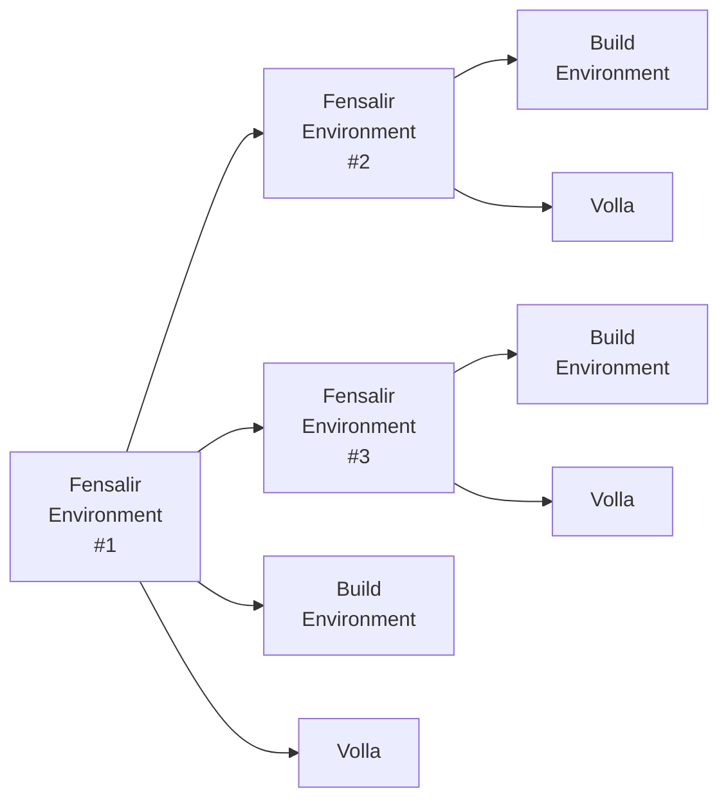
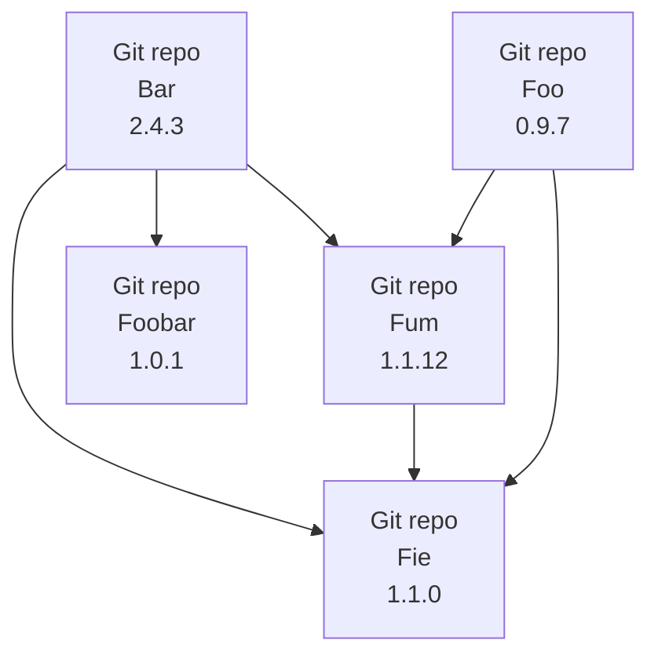
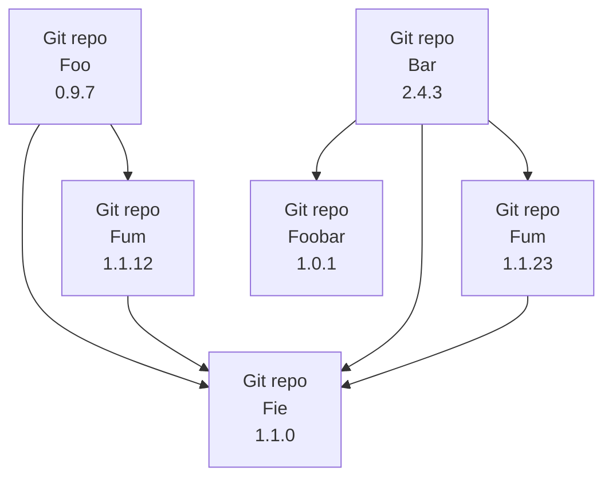
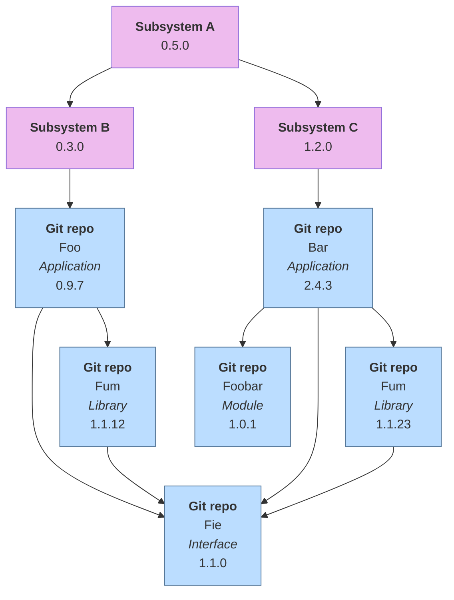
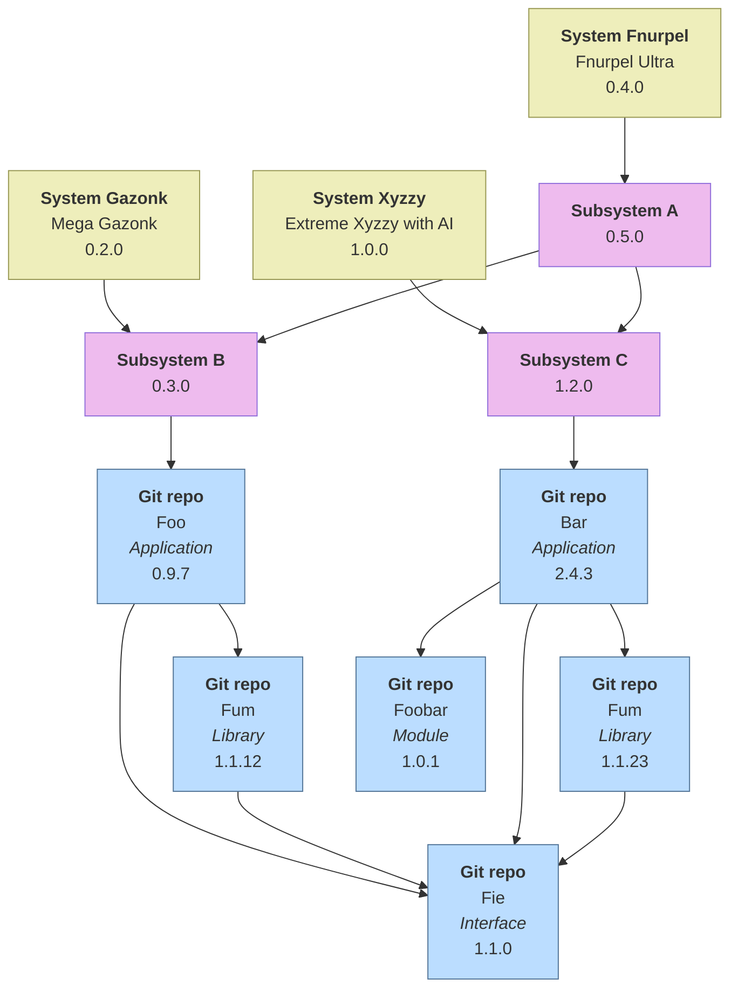

# Installation Instructions

After the repo has been cloned to a temporary location run the
bootstrap script found in the root of the repo (**$** is used for
illustrating the shell prompt)

```
$ ./bootstrap --instructions
```

**or**

```
$ ./bootstrap --i
```

For further information please use `bootstrap --help` **or**
`bootstrap -h` option instead.

# From where does the names Fensalir, Frija and Volla originate?

**Fensalir** (this repo) was the location where the godess Frigg/Frija
dewells in old norse mythology. The Old High German name of the godess
Frigg was [Frija](https://en.wikipedia.org/wiki/Frigg) and she
confided her secrets to her sister
[Volla](https://en.wikipedia.org/wiki/Fulla) (Old High German name of
Fulla) who also tended to Frijas ashen box among other things.

# What is Frija and Volla?

Frija is a set of Bash shell scripts combined with configuration of
the Bash shell aimed at supporting devlopers working with sets of Git
repos that depend on (possibly) specific versions of each other. The
aim of Frija is to also be able to support environments where concepts
such as information classification, 'other' information
classifications, information sharing with restrictions
("delgivningsbarhet" in Swedish), and export control classifications
as well as software licenses, export control licenses, and software
patent licenses.

> [!IMPORTANT]
> All Frija commands support TAB-completion of options, arguments and,
> where it makes sense, also TAB-completion of argument
> values. Furthermore all Frija commands are also implemented with
> extensive built-in help information (reachable via the `-h` or
> `--help` command line options).

This means that a developer must be able to build software
configurations where you can trust that the given configuration is
allowed to be shared with the intended receipients as well as being
able to reproduce builds of a software system versions that are
several years old (provided that the build tool versions and versions
of external library dependencies needed are available).

Frija depend on dependency information exported from Volla in the
`*.repos` format (row and column based text file format). Due to that
Volla is not yet implemented files in the `*.repos`file format
unfortunately have to be crafted and updated manually. With that said,
Frija do have support for bumping version numbers of dependencies that
is saved in a new file instance. The format has successfully been
tested for an application consisting of about 200 repos with
interdependencies together with Frija, thus even if the format as such
is a bit quirky it is managable to be used by humans despite that it
is actually intended to be only a machine-readable file format.

As Frija (and Volla) are also designed to support multi-site and
multi-country development where the development environments does not
have network connectivity with each other, the local site-unique
specifics might differ (like search paths and host name of Git-remote
server). Due to this Frija assumes that the "Volla database"
(e.g. `*.repos`file) and "site specific configuration" (or "build
environment") is stored in different repos, where at least the latter
might vary between development sites. The former must differ if there
are information sharing restrictions to be considered. And to bind a
combination of the two repos together a third repo is used that
contain a configuration file pointing to the two other repos. Thus you
have this conceptual setup



Frija supports also generalizing this even more like this



Thus, after installing Frija the user has to obtain a URI to a
Fensalir Environment repo and feed that URI to Frija using the
`fensalir fetch`command. Frija will then follow the URI and clone all
the referenced repos. Once that is done it is possible to create a
Frija Workspace and the repos file to use for that Workspace using the
`frija workspace` command.

> [!TIP]
> The `fensalir` commands are used for operating on the meta-level,
> that is Fensalir Environment repos and so on. The `frija` commands
> are used for operating on a Frija Workspace. A future `volla`
> command would then operate on Volla databases connected to a Frija
> Workspace.

Once a Workspace is created Frija can be instructed to clone all the
repos listed in the `*.repos` file (applicable for the current
operating system); this is done using the `frija clone` command.

Example output from `frija status` command
```
$ frija status --input=Pong
================================================================================
Reading from Pong.repos and checking if there are any changes...
--------------------------------------------------------------------------------
.....
  Nanna/gna_pong_ball (master)
   Unstaged change (1)
     modified   Makefile.extras
.
  Nanna/gna_pong_left_player (master)
   Unstaged change (1)
     modified   Makefile.extras
.
  Nanna/gna_pong_right_player (master)
   Unstaged change (1)
     modified   Makefile.extras
.
  Nanna/gna_pong_visual (master)
   Unstaged change (1)
     modified   Makefile.extras
.....
  Nanna/gna_soft_kernel_clock (master)
   Unstaged change (1)
     modified   Makefile.extras
.
  Nanna/gna (master)
   Unstaged change (1)
     modified   Makefile.extras
.
================================================================================
  Summary
  -------
  6 dirty repos
$
```

## Multiple Versions of the Same Repo

In the `*.repos` file there is a version number column for specifying
the version to use of the referenced repo. The version number either
basically follows Semantic Versioning syntax or is the special keyword
`floating`. The latter is interpreted by Frija as "the latest
available version on the selected branch" which is useful when
developing on a feature branch.

In order to avoid cloning the same repo multiple times Frija utilizes
`git worktree` combined with naming the versioned worktrees as the
name of the original repo appended with the version number specified
in the `*.repos` file, e.g. `foo@0.9.7` where this worktree is a
(headless) checkout of the version tag for version 0.9.7.

### Versions and Git Tags

In Git tags are *not* subject to Pull Request reviews, that is tags
can be *created and deleted for commits on any branch by anyone with
write access to the repo*. In order to mitigate this Frija relies on a
technique where the version number identifier, for instance `1.2.3`,
is appended with a small portion of the Git commit hash for the commit
the tag is attached to. Frija employs checks to ensure that a version
tag is attached to the correct commit by comparing the commit hash
embedded in the tag with the actual commit hash for the commit the tag
is attached to.

Frija also provides the command `frija tag` to simplify version tag
creation as well as version number (and version tag) bumping. The
versions created by this command always start out as `x.y.z-rc1`
(Release Candidate #1), where the RC-field can be stepped. Once
satisfied the relase candidate version can be promoted to a "released
state" where the `-rc` part is removed from the version number. A new
release candidate version can then be created (either as a new major,
minor or patch version) and the cycle is repeated.

> [!NOTE]
> Frija only allows version tags to be attached to commits on develop
> and master branches, and thus not on commits on a feature
> branch. Appart from that it does not make sense to be talking about
> versions on feature branches, tags are attached to a specic commit
> checksum in Git. This means that when a branch is rebased any tags
> attached to commits that are rebased does not follow the
> rebase. They remain on their old commits. As Frija assumes One Track
> methodology, rebases on the feature branches could be frequent,
> which implies that tags on feature branches should only be used as
> local bookmarks and not be published to the remote repo.

## Build Environment

As the name suggests, this repo captures the quirks of the local
environment (or domain) with a focus on the *build* environment where
the Makefile executes when building with Frija (see below).

Each build environment repo must contain a `SECI` (as in "Software
Environment Configuration Index" or similar) folder which in turn
contians `*.seci` files. These files are similar to module files used
by the **module** shell command. The main difference is that `*.seci`
files are purely declarative and possible to interpret by a Bash
script whereas module files are written in the TCL scripting language
using an API provided by the module command that is also written in
TCL.

The purpose of the `*.seci` files are to capture the shell
configuration (setting or appending to) environment variables as well
as controlling which of them should only be available to the **Make**
program and which should also be made available to the commands Make
execute in the Makefile recepies.

The `*.repos` file in turn references `*.seci`files per repo row which
are applied when file in that repo are built (by the Frija-provided
Makefile).

## Building with Frija

In order to support building of applications that consist of a set of
repos, that is one application is not defined as a single repo
(mono-repo). That is, information sharing restrictions create
interesting problems. For instance a repo that is sharable with A and
B may not contain information that is specific to A or B, and
especially not information about C that neither A nor B should know
about. This is at the center of MCH (Multi Customer Handling) and the
concepts of *deleteable* and *selectable*.

> [!CAUTION]
> If something is *deleteable* then it must be guaranteed that all
> traces of it are not included in a delivery. The easiest way of doing
> so is placing the deleteable part in a separate repo and create a
> configuration that does not include the deleteable repo.
> 
> The implication of this is that a repo may never store information
> about its dependencies within the repo itself; the information must be
> stored outside of the repo and then *injected at build time*.

Thus the build system must be able to handle modules (represented as
repos with source code) that might or might not be included in the
build, depending on external configuration. Furthermore, the search
path to the repos might be dependendent on the developer (for instance
if the repos are stored in the home folder of the developer then the
search paths to the repos contain the userid of the developer). And
the name of the referenced repos might differ depending on the
intended customer for the build result (due to the deleteable aspect).

Frija solves this by reading the dependency informations from the
`*.repos` file and generate the necessary build-glue-information
needed by the build system so it then can locate the source code. Thus
building with Frija is a two-step process

1. Generate dependency information for build system usage
2. Build the source code

where the first step is only needed initially and each time inter-repo
dependencies are modified in the `*.repos` file.

The generated dependency information is stored in GNU Makefile format
suitable to be included by a GNU Makefile. Incidentally, the Fensalir
repo includes a Makefile (actually three Makefile fragments; a
preamble, a postamble, and a middle part) designed for consuming these
generated fragments. This setup automatically discoveres source code
stored in the repos and builds them, provided that some rules are
followed

- A GNU Makefile fragment called `Makefile.extras` is stored in the
  root of the repo; Fensalir repo contain a template with
  documentation comments within the Makefile fragment.

- Source code representing the repo as a whole is stored in a `src`
  folder located in the root of the repo. The `Makefile.extras`
  Makefile fragment may add additional folders that the Makefile will
  search for source code.

- Source code representing an executeable are placed in subfolder to a
  `binsrc` folder located in the root of the repo. The name of the
  subfolder is identical to the name of the resulting executable, and
  the subfolder must also contain a `Makefile.buildoptions` Makefile
  fragment. As with `Makefile.extras` the Fensalir repo contain a
  template for this file as well.

- Source code representing a library are placed in a subfolder to a
  `libsrc` folder located in the root of the repo. The name of the
  subfolder is the name of the resulting library with `lib` prefix
  inserted automatically by the Makefile. As with the executeable
  file, a `Makefile.buildoptions` file must be placed in the folder.

The Fensalir/Frija Makefile support source code in C (with `.c`
extension), C++ (with `.cpp` and `.cc` extensions), and Fortran (with
`.f` extension). Dependency information is also automatically
generated for C, C++, **and** Fortran (include directives are
extracted by the Makefile and from those dependency rules are
automatically generated on-the-fly).

Object files are placed in a `Build` folder in the root of each repo,
and the build result is placed in a `Result` folder in the root of
each repo.

> [!TIP]
> Folders with initial uppercase like `Build` and `Result` are folders
> automatically created by the GNU Makefile. Folders with initial
> lowercase like `src`, `binsrc`, and `libsrc` are assumed to be
> folders containing version controlled files.

# Volla
To realize this the concept of Volla was conceived, where Volla hosts
a distributed dependency graph of the dependencies between repos. This
dependency graph consists of nodes with **meta**information about
repos and this not the repos themselves. A trivial example would be



Which describes the relationships for two applications **Foo** and
**Bar** that both depend on the same implementation of library **Fum**
where the interface to **Fum** is stored in **Fie**. Storing the
interface in a separate repo enables multiple parallell
implementations of the same interface that can have different
sharability properties.

The situation could also have looked like this



That is, both **Foo** and **Bar** depend on **Fum**, but **Foo**
depend on *version* 1.1.12 of **Fum** and **Bar** depend on *version*
1.1.23 of **Fum** and both versions implement version 1.1.0 of the
interface (stored in repo **Fie**). The implication of this is that
Frija must be able to support multiple cloned versions of the same Git
repo, see [Multiple Versions of the Same
Repo](#multiple-versions-of-the-same-repo) above.

## DAG (Directed Acyclic Graph)

In computer science nad graph theory it is often very fruitful to
require that a graph must allways meet the requirements of a DAG. That
is all bows between nodes are directed (have exactly one arrowhead
pointing in the direction of the relation between the two
nodes). Furthermore the 'acyclic' property means that there are no
cycles between nodes. If you have a program with cyclic dependencies
between main program and libraries this usually causes lots of
headaches (and might mean that the program is not possible to
compile). Simply put, the Volla dependency graph must be possible to
represent as a DAG. If a loop occurrs in the dependency graph then it
is possible for Volla to detect this, and thus this property of the
dependency graph can be enforced.

## Kinds of Repos

As can be inferred from the discussion above, there are different
kinds of repos. For instance 'application repos', 'interface repos',
'library repos', 'plugin repos', and 'data repos'. This meta
information is useful to include in the nodes describing the
dependency graph.

## Kinds of nodes

It is fruitful to also be able to group related nodes of repos, for
instance a 'data repo' node that collects a set of dependencies to
repo-nodes of kind 'data repo', but these grouping nodes are
optional. Another kind of node that need to be represented is
'subsystem'.

### Subsystem nodes

A **subsystem** is *a system that is part of a larger system* and that
provides some kind of function that is *potentially reusable* in other
subsystems (or systems). Thus subsystem nodes are used for creating
group hierarchies that can potentiall be reused by other subsystems by
simply having a dependency to such a subsystem, that is



### System nodes

Finally a **system** can be defined by pointing to a **subsystem**,
for instance



Worth noting is that the system nodes carry two names; an *internal*
name (project name or similar) and an *official* name (**Mega
Gazonk**, **Extreme Xyzzy with AI**, and **Fnurpel Ultra** in above
example). The official name is the marketing name that is used towards
customers and is basically set by "The whims of Product Management",
whereas the internal name is more fixed and seldom changes over the
years.
